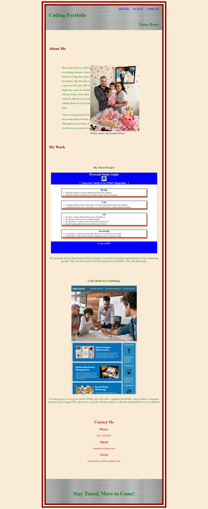

# Code-Portfolio

## Description

- My goal was to build a website that I will continuously update to showcase my coding projects

- The website will allow me to provide centralized content for showcasing my work to future employees and colleagues

- I used HTML and CSS to build the features and styling of the website

- I learned how to use the anchor element in HTML to build interactive features into my website

## Features

- You can use the top menu bar to click and automatically scroll to each website section

- You can click on each project picture to be re-directed to its live page

## This is a screenshot of my deployed webpage

[Git-Pages-Link](https://nolenhowe.github.io/code-portfolio/)